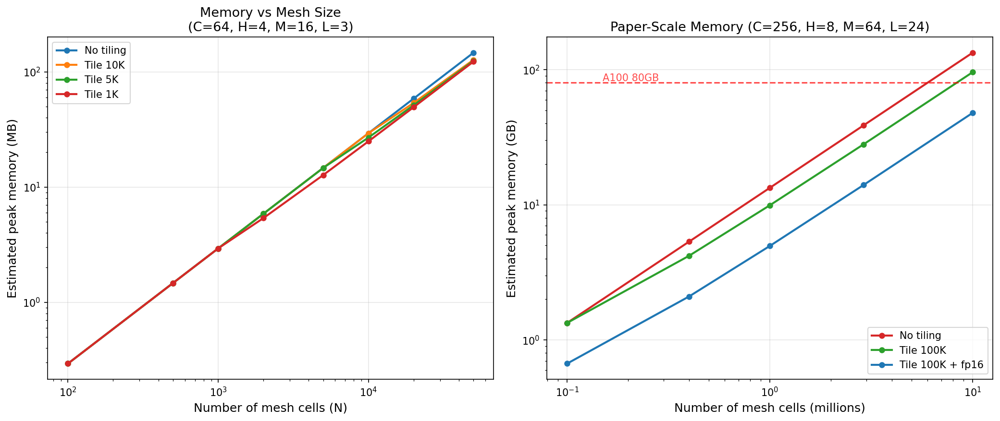
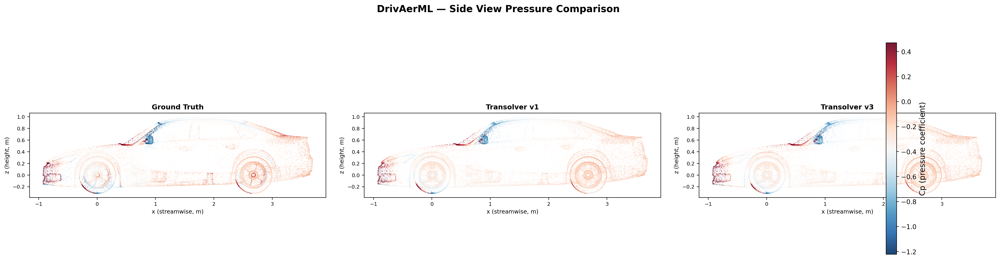

# Transolver-3

Scaling Transformer Solvers to Industrial-Scale Geometries (100M+ cells).

Based on the [Transolver paper](https://arxiv.org/abs/2402.02366) (ICML 2024 Spotlight) and the [Transolver-3 paper](https://arxiv.org/pdf/2602.04940).

## Key Innovations

1. **Faster Slice & Deslice** — Linear projections moved from O(N) mesh domain to O(M) slice domain via matrix multiplication associativity
2. **Geometry Slice Tiling** — Input partitioned into tiles with gradient checkpointing, reducing peak memory from O(NM) to O(N_t*M)
3. **Geometry Amortized Training** — Train on random subsets (100K-400K) of full mesh each iteration
4. **Physical State Caching** — Two-phase inference: build cache from chunks, decode any point
5. **Mixed Precision** — Full autocast + GradScaler support, halving memory footprint
6. **Mesh-Sharded Distribution** — Shard meshes >100 GB across GPUs; all-reduce only the tiny slice accumulators (~514 KB/layer)

<p align="center">

</p>

## Setup

```bash
uv sync              # install dependencies
uv run pytest        # run tests (52 tests)
```

## Get Started

```python
import mlflow
import torch
from transolver3 import Transolver3, CachedInference, InputNormalizer, TargetNormalizer
from transolver3.amortized_training import train_step, create_optimizer, create_scheduler

# Create model
model = Transolver3(
    space_dim=3, n_layers=24, n_hidden=256, n_head=8,
    fun_dim=0, out_dim=4, slice_num=64,
    tile_size=100_000,       # auto-compute tiles (paper Table 5)
    mlp_chunk_size=100_000,  # tile MLP for large N
)

# Training with mixed precision + MLflow tracking
optimizer = create_optimizer(model)
scheduler = create_scheduler(optimizer, total_steps=50000)
scaler = torch.amp.GradScaler()

with mlflow.start_run(run_name="drivaer-ml-24L-256H"):
    mlflow.log_params({
        "n_layers": 24, "n_hidden": 256, "n_head": 8,
        "slice_num": 64, "tile_size": 100_000,
    })

    for step in range(50000):
        loss = train_step(model, x, fx, target, optimizer, scheduler,
                          tile_size=100_000, scaler=scaler)
        mlflow.log_metric("train_loss", loss, step=step)

    # Log the trained model
    mlflow.pytorch.log_model(model, artifact_path="transolver3")

# Inference on industrial-scale meshes (160M+ cells)
engine = CachedInference(model, cache_chunk_size=100_000, decode_chunk_size=50_000)
output = engine.predict(x_full_mesh)
```

## File Structure

```
transolver3/                          # Core package
├── physics_attention_v3.py           # Optimized Physics-Attention
├── transolver3_block.py              # Encoder block with tiled MLP
├── model.py                          # Transolver3 model
├── amortized_training.py             # Training (sampler, loss, scheduler, train_step)
├── inference.py                      # CachedInference + DistributedCachedInference
├── distributed.py                    # Multi-GPU mesh sharding utilities
├── normalizer.py                     # InputNormalizer, TargetNormalizer
├── profiling.py                      # Memory/latency benchmarking
└── common.py                         # MLP, activations, timestep_embedding

Industrial-Scale-Benchmarks/          # Experiments
├── exp_nasa_crm.py                   # NASA-CRM (~400K cells)
├── exp_ahmed_ml.py                   # AhmedML (~20M cells)
├── exp_drivaer_ml.py                 # DrivAerML (~160M cells, single GPU)
├── exp_drivaer_ml_distributed.py     # DrivAerML distributed (multi-GPU)
├── dataset/                          # Dataset loaders (with mesh sharding)
└── utils/metrics.py                  # Evaluation metrics

experiments/                          # v1 vs v3 comparison
├── compare_v1_v3_drivaer.py          # Synthetic data comparison
├── compare_v1_v3_real_drivaer.py     # Real DrivAerML VTP data comparison
├── COMPARE_v1v3.md                   # Results and analysis
└── results/                          # Pressure heatmap PNGs

benchmarks/                           # GPU benchmarking
├── gpu_memory_benchmark.py           # Sweep mesh sizes, measure all 3 phases
└── test_sharded_distributed.py       # Distributed sharding validation test

SPECS/DISTRIBUTED.md                  # Multi-GPU distribution design spec
tests/                                # 52 tests
├── test_transolver3.py               # Core model tests (41)
└── test_distributed.py               # Distributed sharding tests (11)
```

## Memory Scaling

<p align="center">

</p>

With tile_size=100K and fp16, the paper's claim of **2.9M cells on a single A100 80GB** is achievable (~14 GB activations).

## Profiling

```python
from transolver3.profiling import benchmark_scaling, format_benchmark_table

results = benchmark_scaling(model, mesh_sizes=[1000, 10000, 100000],
    configs=[
        {'label': 'no_tiling', 'num_tiles': 0},
        {'label': 'tile_100k', 'tile_size': 100_000},
    ])
print(format_benchmark_table(results))
```

## Distributed Training (Huge Meshes >100 GB)

For meshes that exceed single-node memory, Transolver-3 supports mesh-sharded
distribution across multiple GPUs. Each GPU loads only 1/K of the mesh via mmap
range reads. The key insight: the slice accumulators `s_raw (B,H,M,C)` are
**additive** — they can be independently computed from disjoint mesh partitions
and all-reduced (~514 KB per layer).

```bash
# Multi-GPU training with mesh sharding (8 GPUs)
torchrun --nproc_per_node=8 Industrial-Scale-Benchmarks/exp_drivaer_ml_distributed.py \
    --data_dir /path/to/drivaer_ml --field surface

# Smaller mesh that fits in RAM: disable sharding (classic DDP)
torchrun --nproc_per_node=8 Industrial-Scale-Benchmarks/exp_drivaer_ml_distributed.py \
    --data_dir /path/to/drivaer_ml --no-shard-mesh

# Enable sharded inference too (for meshes that don't fit in one node's RAM)
torchrun --nproc_per_node=8 Industrial-Scale-Benchmarks/exp_drivaer_ml_distributed.py \
    --data_dir /path/to/drivaer_ml --shard-eval
```

On Databricks, use `TorchDistributor` on multi-GPU instances (g5.12xlarge, p4d.24xlarge):

```bash
databricks bundle deploy -t a10g
databricks bundle run distributed_sharded_test -t a10g
```

Validated on 2x NVIDIA A10G: sharded cache and decode produce **zero numerical difference** vs single-GPU. See [SPECS/DISTRIBUTED.md](SPECS/DISTRIBUTED.md) for the full design.

## GPU Benchmark (Databricks Asset Bundle)

Deploy and run the GPU memory benchmark on Databricks using DABs.

Three targets map to different GPU instances:

| Target | Instance | GPU | VRAM |
|--------|----------|-----|------|
| `a10g` (default) | `g5.xlarge` | 1x NVIDIA A10G | 24 GB |
| `a100_40` | `p4d.24xlarge` | 8x NVIDIA A100 | 320 GB |
| `a100_80` | `p4de.24xlarge` | 8x NVIDIA A100 | 640 GB |

Jobs: `gpu_memory_benchmark` (single-GPU sweep), `distributed_sharded_test` (2-GPU validation on g5.12xlarge).

```bash
# Deploy and run on g5.xlarge (A10G)
databricks bundle deploy
databricks bundle run gpu_memory_benchmark

# Deploy and run on A100
databricks bundle deploy -t a100_40
databricks bundle run gpu_memory_benchmark -t a100_40
```

The benchmark sweeps mesh sizes and measures peak GPU memory across all 3 pipeline phases (training, cache build, decode) using synthetic DrivAer ML data.

## v1 vs v3 Comparison

Includes experiments comparing Transolver v1 and v3 on both synthetic and real DrivAerML data. See [experiments/COMPARE_v1v3.md](experiments/COMPARE_v1v3.md) for full results and pressure heatmaps on the real DrivAer vehicle.

<p align="center">

</p>

## Citation

```
@inproceedings{wu2024Transolver,
  title={Transolver: A Fast Transformer Solver for PDEs on General Geometries},
  author={Haixu Wu and Huakun Luo and Haowen Wang and Jianmin Wang and Mingsheng Long},
  booktitle={International Conference on Machine Learning},
  year={2024}
}

@article{wu2026Transolver3,
  title={Transolver++: Industrial-Scale Simulation with Transformer Solvers},
  author={Haixu Wu and Huakun Luo and Haowen Wang and Jianmin Wang and Mingsheng Long},
  journal={arXiv preprint arXiv:2602.04940},
  year={2026}
}
```
