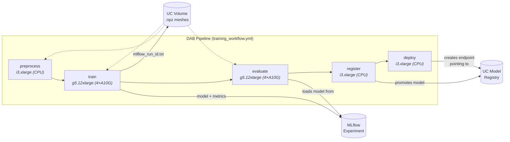
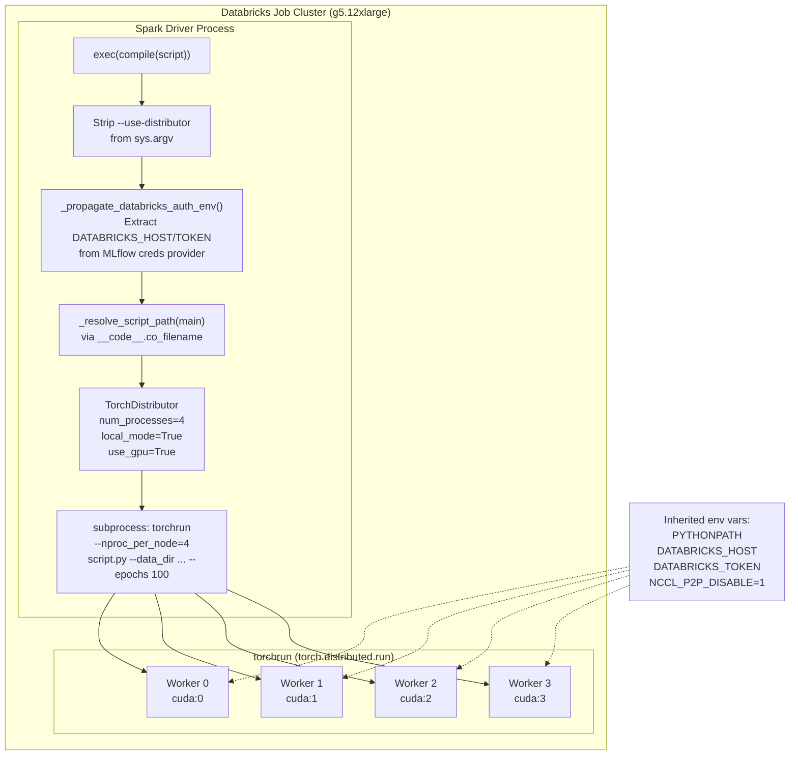
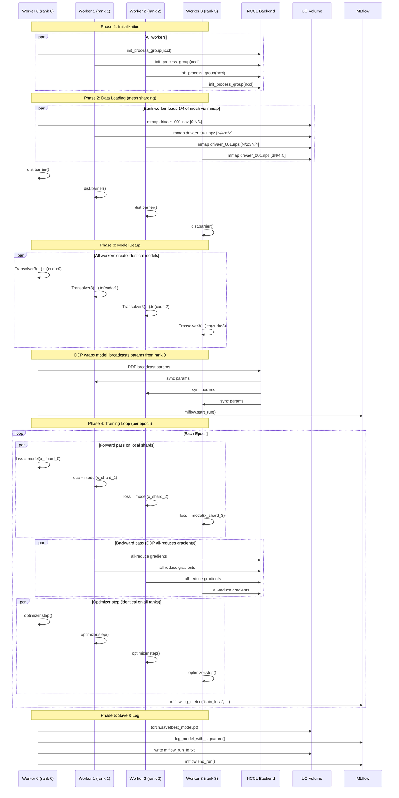
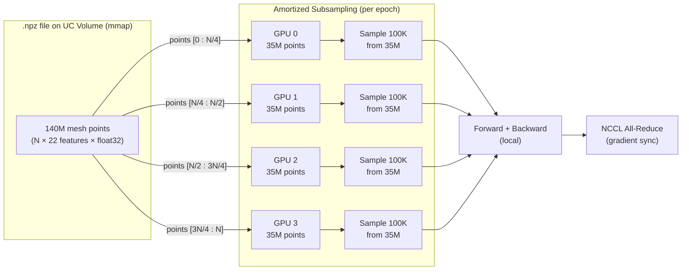
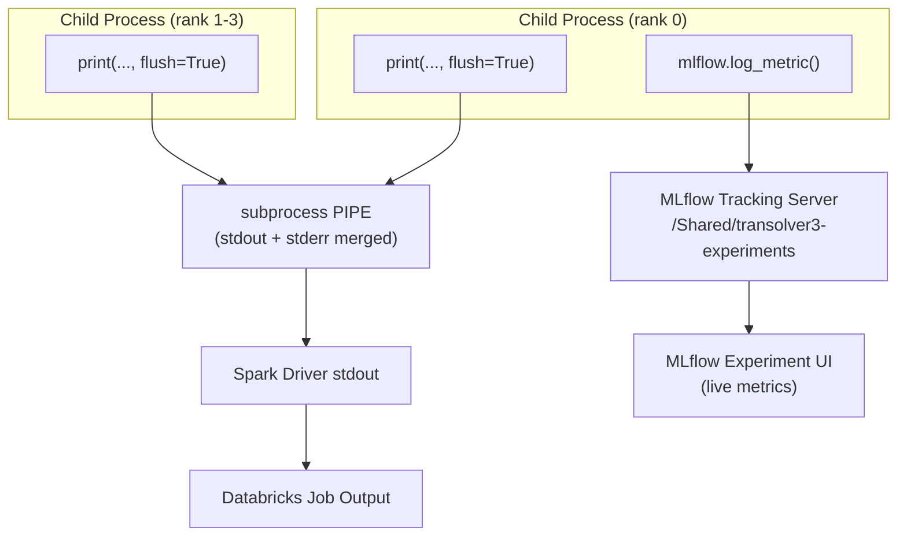
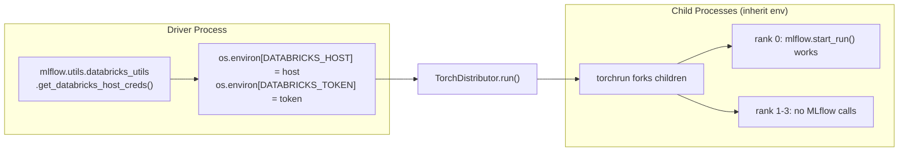

# Distributed Training Architecture

Multi-GPU mesh-sharded training of Transolver-3 on Databricks via TorchDistributor.

## DAB Pipeline Overview

The full training pipeline is a 5-task Databricks Asset Bundle workflow. Each task runs on its own cluster, with MLflow as the single source of truth for model artifacts.

## Train Task: Process Architecture

The train task uses TorchDistributor in `local_mode=True` on a single multi-GPU node. The Databricks Spark driver process launches TorchDistributor, which spawns child processes via `torchrun`.

## Worker Lifecycle

Each worker process (spawned by torchrun) executes `main()` independently. Synchronization happens at DDP barriers and NCCL all-reduce operations.

## Mesh Sharding Strategy

Each GPU loads only 1/K of the mesh from disk using memory-mapped range reads. This avoids loading the full mesh (which can be 12 GB per sample) into each GPU's memory.

- **No data duplication**: each GPU reads a disjoint byte range from the mmap'd file
- **Amortized training**: each GPU further subsamples 100K points from its shard per iteration
- **Communication**: only gradients are all-reduced (~27 MB for 6.7M params), not data

## Logging & Observability

Key design decisions:
- **`print(flush=True)` over `logging`**: TorchDistributor captures subprocess stdout via pipe. Python `logging` defaults to stderr and adds buffering. `print` with `flush=True` is the most reliable path.
- **Timestamps on all log lines**: `[HH:MM:SS]` prefix, since TorchDistributor buffers output and Databricks UI may not show real-time.
- **`logall()` vs `log()`**: `logall()` prints on all ranks with `[rank N]` prefix for debugging. `log()` prints on rank 0 only for production. Before `dist.init_process_group()`, `logall()` falls back to `[pid N]`.
- **MLflow only on rank 0**: avoids duplicate metrics. Auth propagated from driver via `DATABRICKS_HOST`/`DATABRICKS_TOKEN` env vars extracted from the driver's MLflow credential provider.

## Environment Variable Propagation

The driver process has implicit Databricks auth. Child processes (spawned by torchrun) don't. The auth bridge:

Other propagated env vars:
| Variable | Purpose |
|---|---|
| `PYTHONPATH` | Points to workspace files so `transolver3` and `dataset` are importable |
| `NCCL_P2P_DISABLE=1` | Disable GPU P2P on PCIe-connected A10Gs (g5.12xlarge) |
| `NCCL_ASYNC_ERROR_HANDLING=1` | Non-blocking NCCL error detection |

## Instance Types

| Target | Instance | GPUs | VRAM | Mesh Sharding | Use Case |
|---|---|---|---|---|---|
| `a10g` | g5.12xlarge | 4× A10G | 96 GB | 4-way | Default training |
| `a100_40` | p4d.24xlarge | 8× A100 | 320 GB | 8-way | Large-scale training |
| `a100_80` | p4de.24xlarge | 8× A100-80 | 640 GB | 8-way | Full DrivAerML (140M pts) |

The `a10g` target uses ON_DEMAND instances to avoid spot capacity issues with g5.12xlarge.
