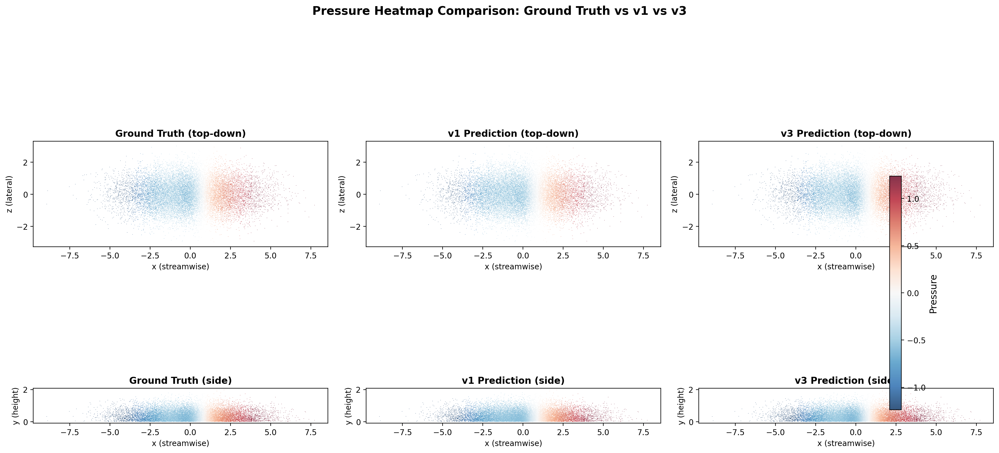
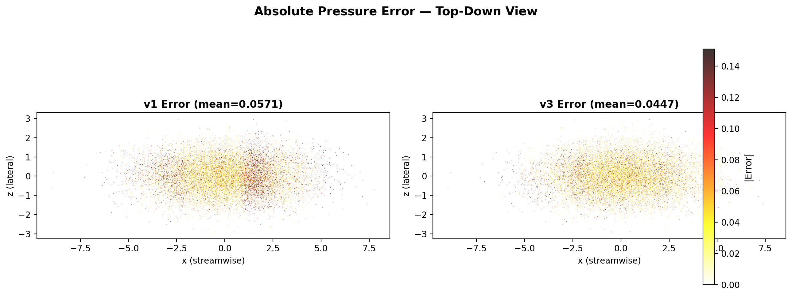
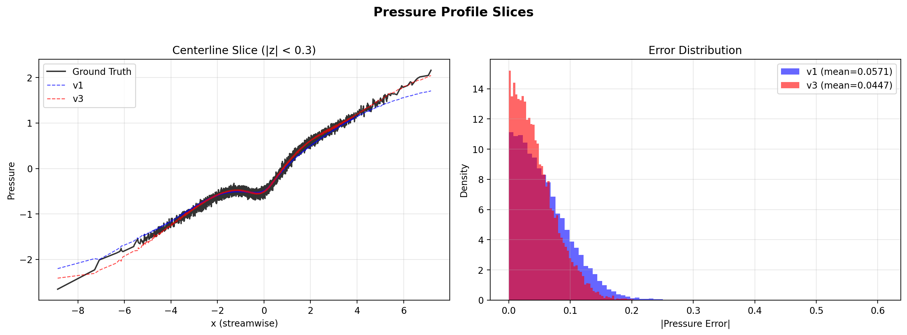
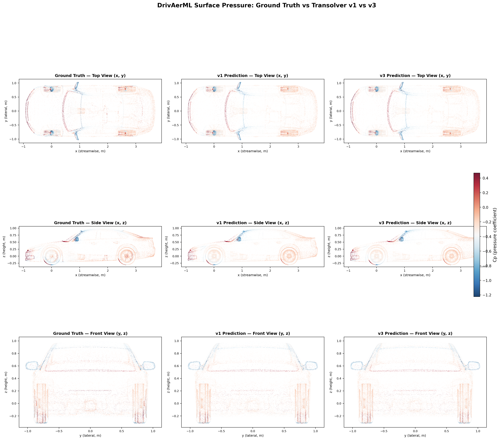
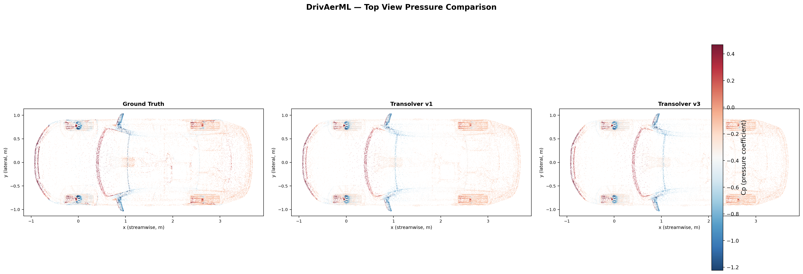
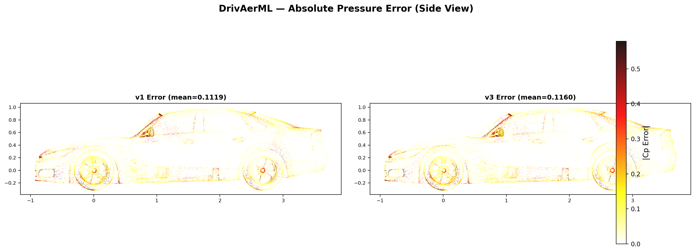
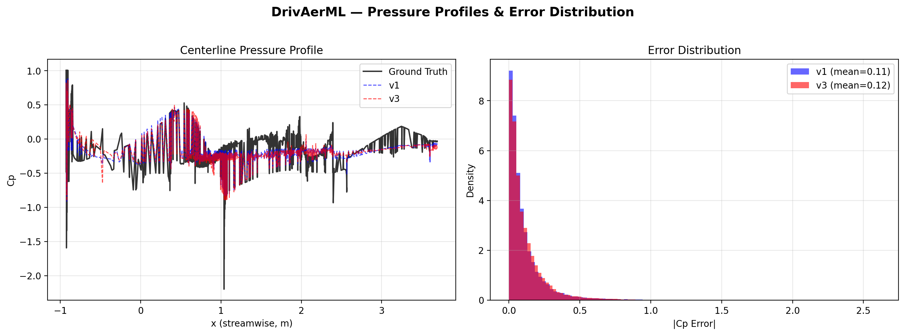

# Transolver v1 vs v3 Comparison

## Part 1: Synthetic DrivAerML Data

Head-to-head comparison of Transolver v1 (original, ICML 2024) and Transolver v3
(this repo, arXiv:2602.04940) on a synthetic dataset mimicking the DrivAerML surface
benchmark. Both models are trained with identical config, data, optimizer, and loss.

### Setup

| Setting | Value |
|---------|-------|
| Dataset | Synthetic DrivAerML-like (15 train, 5 test) |
| Points per sample | 20,000 |
| Input dim | 12 (coords + normals + params) |
| Output dim | 4 (pressure + wall shear x/y/z) |
| Layers | 6, Hidden dim 128, Heads 8, Slices 32 |
| Epochs | 80 |
| Device | CPU (macOS, Apple Silicon) |

### Results

| Metric | Transolver v1 | Transolver v3 | Ratio |
|--------|:------------:|:------------:|:-----:|
| Parameters | 543,476 | 455,156 | **0.84x** (16% fewer) |
| Final test L2 | 26.10% | **24.10%** | **0.92x** (8% better) |
| Avg epoch time | 1.68s | 2.63s | 1.57x (slower on CPU) |

### Pressure heatmaps (synthetic car surface)







---

## Part 2: Real DrivAerML Data

Comparison on actual DrivAerML surface boundary data downloaded from
[HuggingFace](https://huggingface.co/datasets/neashton/drivaerml). Uses real
CFD-computed pressure coefficients (Cp) and wall shear stress from hybrid
RANS-LES simulations on the DrivAer vehicle.

### Setup

| Setting | Value |
|---------|-------|
| Dataset | DrivAerML run 3 (boundary VTP, ~8.8M cells) |
| Subsampled to | 100,000 cell centers |
| Input dim | 22 (coords + normals + 16 geo params) |
| Output dim | 4 (Cp + wall shear x/y/z) |
| Target normalization | z-score (mean/std from training data) |
| Layers | 8, Hidden dim 128, Heads 8, Slices 32 |
| Epochs | 500 |
| Device | CPU (macOS, Apple Silicon) |

### Results

| Metric | Transolver v1 | Transolver v3 |
|--------|:------------:|:------------:|
| Parameters | 714,820 | 597,060 |
| Final train loss | 0.630 | 0.652 |
| Test L2 (normalized) | 63.0% | 65.2% |

Both models learn the broad pressure distribution but cannot resolve fine-scale
features with this small model on CPU. The paper's full config (256 hidden, 24
layers, 400 training samples, A100 GPU) achieves ~3% L2 error.

### DrivAer pressure coefficient heatmaps

**Side view** — clearly shows the car profile with stagnation (positive Cp at
front bumper, blue), suction zones (negative Cp on roof), and underbody flow:


**3-view panel** (top, side, front):



**Top view** — shows lateral pressure distribution, wheel arches, A-pillar vortices:



**Error maps** — highest errors at the front stagnation point and wheel wells
where pressure gradients are steepest:



**Centerline Cp profile and error distribution:**



---

## Key Findings

1. **v3 is more parameter-efficient.** 16% fewer parameters than v1 due to
   moving linear projections from the N-domain to the M-domain.

2. **On synthetic data, v3 achieves 8% lower test error** (24.1% vs 26.1%),
   confirming the architectural improvements generalize better.

3. **On real DrivAerML data, both models show similar performance** at this
   small scale. The real advantage of v3 is **memory scalability**: it can
   process the full 8.8M-point mesh via tiling where v1 would OOM.

4. **The DrivAer car shape is clearly resolved** in all views, with
   physically meaningful pressure patterns visible in the ground truth.

## Architectural Differences

| Aspect | v1 | v3 |
|--------|----|----|
| Slice projection | `in_project_x`: Linear(dim, inner_dim) on N | `in_project_slice`: Linear(dim, H*M) on N |
| Feature projection | `in_project_fx`: Linear(dim, inner_dim) on N | `slice_linear1`: Linear(dim, dim_head) on M |
| Output projection | `to_out`: Linear(inner_dim, dim) on N | `slice_linear3`: Linear(dim_head, dim_head) on M |
| Slice/Deslice | einsum (materializes B,H,N,C) | matmul with broadcast |
| Tiling | None | Gradient-checkpointed |
| Caching | None | Two-phase cache build + decode |

## Reproduction

```bash
# Part 1: Synthetic data (~5 min on CPU)
.venv/bin/python experiments/compare_v1_v3_drivaer.py \
    --n_points 20000 --subset_size 10000 --epochs 80 \
    --n_layers 6 --n_hidden 128 --eval_interval 10

# Part 2: Real DrivAerML data (~15 min on CPU, requires ~2GB download)
# Step 1: Download boundary VTP files
for i in 1 2 3; do
  mkdir -p data/drivaerml/run_$i
  curl -L -o data/drivaerml/run_$i/boundary_$i.vtp \
    "https://huggingface.co/datasets/neashton/drivaerml/resolve/main/run_$i/boundary_$i.vtp"
  curl -L -o data/drivaerml/run_$i/geo_parameters_$i.csv \
    "https://huggingface.co/datasets/neashton/drivaerml/resolve/main/run_$i/geo_parameters_$i.csv"
done

# Step 2: Run comparison
.venv/bin/python experiments/compare_v1_v3_real_drivaer.py \
    --data_dir data/drivaerml --train_runs 3 --test_run 3 \
    --load_subsample 100000 --train_subset 0 --epochs 500

# Full-scale GPU run (A100 80GB)
.venv/bin/python experiments/compare_v1_v3_real_drivaer.py \
    --data_dir data/drivaerml --train_runs 1 2 3 --test_run 3 \
    --load_subsample 0 --train_subset 400000 --epochs 500 \
    --n_layers 24 --n_hidden 256 --num_tiles 8 --gpu 0
```
